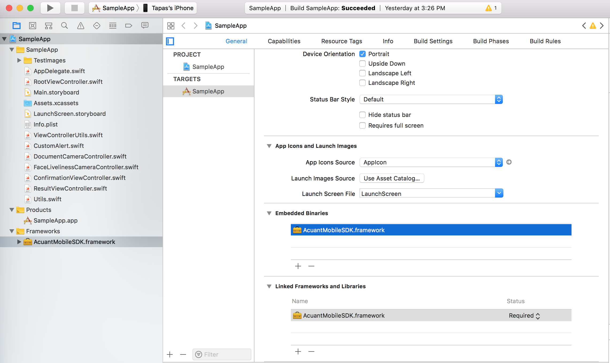

# Acuant iOS Mobile SDK v10

**Last updated – April 9, 2019**

Copyright © 2003-2018 Acuant Inc. All rights reserved.

This document contains proprietary and confidential 
information and creative works owned by Acuant and its respective
licensors, if any. Any use, copying, publication, distribution, display,
modification, or transmission of such technology in whole or in part in
any form or by any means without the prior express written permission of
Acuant is strictly prohibited. Except where expressly provided by Acuant
in writing, possession of this information shall not be
construed to confer any license or rights under any Acuant intellectual
property rights, whether by estoppel, implication, or otherwise.

AssureID and *i-D*entify are trademarks of Acuant Inc. Other Acuant product or service names or logos referenced this document are either trademarks or registered trademarks of Acuant.

All 3M trademarks are trademarks of Gemalto Inc.

Windows® is a registered trademark of Microsoft Corporation.

Certain product, service, or company designations for companies other
than Acuant may be mentioned in this document for identification
purposes only. Such designations are often claimed as trademarks or
service marks. In all instances where Acuant is aware of a claim, the
designation appears in initial capital or all capital letters. However,
you should contact the appropriate companies for more complete
information regarding such designations and their registration status.

**April 2019**

Acuant Inc.

6080 Center Drive, Suite 850

Los Angeles, CA 90045

==================

# Introduction

Acuant Web Services supports data extraction from driver’s licenses, state IDs, other government issued IDs, custom IDs, driver’s licenses, barcodes, and passports. It also supports document authentication and facial recognition to verify and authenticate the identity.

This document contains a detailed description of all functions that developers need to integrate with the Acuant iOS Mobile SDK.

## Setup ##

**Prerequisites:**    iOS version 11.0 or higher.

1.  **Add the Acuant iOS SDK embeded framework:**

	
	
	    
## Initializing the SDK ##

1.	**Set the endpoints:**

		let endPoints = Endpoints()
        endPoints.frmEndpoint = "https://frm.acuant.net/api/v1"
        endPoints.idEndpoint = "https://services.assureid.net"
        endPoints.healthInsuranceEndpoint = "https://medicscan.acuant.net/api/v1"

1. **Set the credentials:**

        let credential = Credential()
        credential.endpoints = endPoints
        credential.username = "userid@acuantcorp.com"
        credential.password = "password"
        credential.subscription = "XXXXXXXX-XXXX-XXXX-XXXX-XXXXXXXXXXXX"

1. **Initialize the Controller:**

        
        Controller.initialize(credential: credential, delegate: InitializationDelegate)
        
        // Delegate Call back
        func initializationFinished(error: AcuantError?) {
        		if(error == nil){
            		// Success
        		}else{
            		// Handle error
        		}
    	}
		
## Capturing an image##

Image capture is illustrated in the Sample App in DocumentCameraController.

**Note**  The illustrated capture code is only helpful if there is a requirement to detect PDF417 2D barcode in the image.

	// To create a document capture session
	   captureSession = Controller.getDocumentCaptureSession(delegate: self,captureDevice: captureDevice)
                
                
    // The following method will start detecting barcode on the document with time in seconds.
    captureSession.startCapturing(timeout: 2)
    
    // When the capture session is set up the following call back will be called
    func didStartCaptureSession()
		 
## Cropping an image##

After an image is captured, it is sent to the cropping library for cropping.

1. **Set card attributes:**

	If the card type is known, then set it to the correct type (for example, CardType.ID1, CardType.ID2, or CardType.ID3). If card type is ID2, then set the card width (in inches). If the card type is either ID1 or ID3, then use the **AUTO**  setting to automatically detect the card type with the cropping function.

		
		let cardAttributes = CardAttributes()
        cardAttributes.cardType = CardType.AUTO
       
       
  **Note**	[https://en.wikipedia.org/wiki/ISO/IEC_7810](https://en.wikipedia.org/wiki/ISO/IEC_7810)
       
1. **Set the cropping options:**

	Set the **CardAttributes**, regardless of whether the captured image(s) is a Health Insurance card, and whether the Image metrics (Sharpness and Glare) are required.
	        
        let croppingOptions = CroppingOptions()
        croppingOptions.cardAtributes = cardAttributes
        croppingOptions.imageMetricsRequired = true
        // For Medical Card set isHealthCard to true
        croppingOptions.isHealthCard = false
	
1. **Set the image to crop:**

		let croppingData = CroppingData()
        croppingData.image = image
     
1. **Crop the image:**

		Controller.crop(options: croppingOptions, data: croppingData)\

**Image class structure:**

		public class Image {
    		public var image : UIImage? = nil
    		public var detectedCardType : CardType = CardType.ID1
    		public var hasImageMetrics : Bool = false
    		public var isSharp : Bool = false
    		public var hasGlare : Bool = false
    		public var sharpnessGrade : Int = 0
    		public var glareGrade : Int = 0
    		public var error : AcuantError? = nil
		}
		
**Note**	A sharpness grade of 50 and above is defined as a sharp image. A glare grade of 50 or higher indicates that there is no glare present in the image.

## Using facial recognition ##

The following sample describes how to create a live face capture session.

1. **Create a live face capture session and a CameraSource:**

		var captureSession = Controller.getFaceCaptureSession
         (delegate: LiveFaceCaptureDelegate,captureDevice:
         captureDevice,previewSize:self.view.layer.bounds.size)
   	 	
1. **LiveFaceCaptureDelegate Callback**

		func liveFaceDetailsCaptured(liveFaceDetails: LiveFaceDetails?) {
        
        if(liveFaceDetails?.faceRect != nil && liveFaceDetails?.image != nil){
            	if(liveFaceDetails?.isLiveFace)!{
                	// Live face is detected
                	
                	// liveFaceDetails?.image is the face image
            	}
        	}        
    	}
    	
    	public class LiveFaceDetails{
    		public var  isLiveFace : Bool = false
    		public var  faceRect : CGRect? = nil
    		public var cleanAperture : CGRect? = nil
    		public var image : UIImage? = nil
    		public var error : AcuantError? = nil
		}
		
		
## Processing the captured images##

Use a Web Service call to process the captured images. 

1. **Set the processing options:**
        
        let attributes = CardAttributes()
        attributes.cardType = CardType.ID1
        
        let options = IdOptions()
        options.isHealthCard = false
        options.cardAttributes = attributes
        
        // For medical card set isHealthCard to true
        options.isHealthCard = false
        
   **Note**  By default, the processing mode is set to the mode enabled in the subscription. However, if a user only requires data capture, then they can limit the processing mode by setting the following option:
 		 
 		 options.processingMode = ProcessingMode.DataCapture
   

1. **Set the processing data:**
        
        let idData = IdData ()
        idData.frontImage = capturedFrontImage
        idData.backImage = capturedBackImage
        idData.barcodeString = capturedBarcodeString
             
1. **Process the ID:**

        Controller.processId(imageData: idData, options: options, delegate: IDProcessingDelegate)
        
        // IDProcessingDelegate callback
        func imageProcessingFinished(result: ImageProcessingResult?) {
        	
        }
                   
## Processing a Facial Match ##

1. **Set the facial data:**

			let facialMatchData = FacialMatchData()
       		facialMatchData.faceImageOne = downloadedImage
            facialMatchData.faceImageTwo = self.capturedLiveFace
                    
1. **Process the facial match:**

 		Controller.processFacialMatch(facialData: facialMatchData, delegate: FacialMatchDelegate)
 		
 		//FacialMatchDelegate callback
 		func facialMatchFinished(result: FacialMatchResult?) {
        	if(result?.error == nil){
           	 //Success
        	}else{
            	// Error
        	}
    	}
    	
##Frequently Asked Questions##

####While publishing the app in the Apple App store we are getting an "Unsupported Architecture" error?####

All frameworks are “fat” (multi-architecture) binaries that contain *slices* for **armv7**, **arm64**, **i386**, and **x86(64)**  CPU architectures. ARM slices are used by physical iOS devices, while i386 and x86(64) are used by the simulator. 

Use the **lipo** command to check which slices are contained in the binaries:

    	lipo -info <path to the file>

You can also use the **lipo** command to remove unwanted slices:

    	lipo -remove i386 <Path to the file> -o <Output file path>

		lipo -remove x86_64 <Path to the file> -o <Output file path>